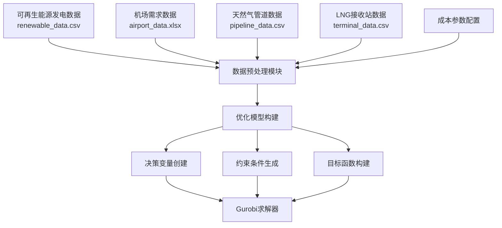
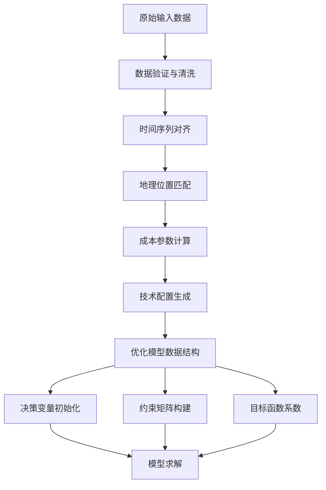
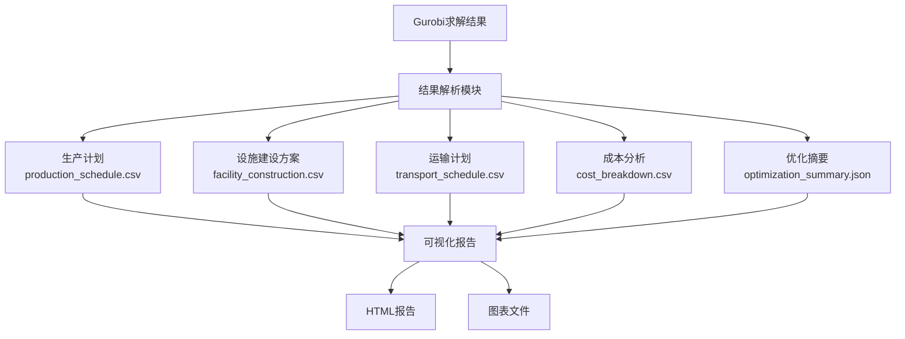

# 天然气供应链优化数学模型与数据流分析

## 摘要

本文档详细描述了基于平准化成本的天然气供应链MTJ航煤生产优化模型的数学模型和数据流结构。该模型采用混合整数线性规划（MILP）方法，使用Gurobi求解器，实现了生产、运输、储存和需求满足的全链条优化。

---

## 1. 数学模型描述

### 1.1 问题概述

该优化模型旨在最小化天然气基MTJ航煤供应链的平准化总成本，同时满足机场需求。模型涵盖：
- 5种MTJ生产技术模式
- 多源天然气供应（管道直供、LNG接收站）
- 可再生能源电解制氢
- 时间尺度匹配（小时级生产vs周级需求）
- 运输网络优化

### 1.2 集合定义

#### 地点集合
- $I$：所有生产地点集合
- $I_{solar}$：太阳能发电站地点集合
- $I_{wind}$：风电站地点集合  
- $I_{airport}$：机场地点集合
- $I_{lng}$：LNG接收站地点集合
- $K$：机场需求地点集合

#### 技术集合
- $J$：MTJ生产技术集合
  - $j_1$：管段直供MTJ生产（pipeline_direct_conversion）
  - $j_2$：机场集成MTJ生产（airport_integrated_conversion）
  - $j_3$：LNG接收站MTJ生产（lng_terminal_conversion）
  - $j_4$：LNG转运MTJ生产（lng_to_hplant_conversion）
  - $j_5$：综合供应MTJ生产（integrated_supply_conversion）

#### 时间集合
- $T$：小时时间集合，$T = \{0, 1, ..., 168-1\}$（1周168小时）
- $W$：周时间集合，$W = \{0, 1, ..., n-1\}$

### 1.3 参数定义

#### 成本参数
- $LCOP_{j}$：技术$j$的平准化产品成本（元/kg）
- $C_{storage}$：储存平准化成本（元/kg·小时）
- $C_{transport}$：运输平准化成本（元/kg·km）
- $C_{electrolyzer}$：电解槽平准化年成本（元/（kg H₂/小时）/年）
- $C_{h2\_storage}$：氢气储存平准化成本（元/kg H₂·小时）
- $C_{h2\_transport}$：氢气运输平准化成本（元/kg H₂·km）
- $C_{ng\_transport}$：天然气运输平准化成本（元/m³·km）
- $C_{infrastructure}_{mode}$：各运输模式基础设施平准化维护成本（元/年）
- $C_{shortage}$：短缺惩罚成本（元/kg）

#### 技术参数
- $\eta_{j}$：技术$j$的转换效率
- $\alpha_{j}$：技术$j$的氢气消耗比（kg H₂/kg MTJ）
- $\beta_{j}$：技术$j$的天然气消耗比（m³ NG/kg MTJ）
- $CF_{j}$：技术$j$的复杂度因子

#### 距离参数
- $d_{i,k}$：地点$i$到机场$k$的实际运输距离（km）
- $d_{h2}(i,j)$：氢气从地点$i$到地点$j$的实际运输距离（km）
- $d_{ng}(i,j)$：天然气从地点$i$到地点$j$的实际运输距离（km）

#### 需求参数
- $D_{k,w}$：机场$k$在第$w$周的MTJ需求量（kg）

#### 能源供应参数
- $RE_{i,t}$：地点$i$在时刻$t$的可再生能源发电量（kWh）
- $\gamma$：电解制氢效率
- $E_{h2}$：制氢电耗（kWh/kg H₂）

### 1.4 决策变量

#### 主要生产决策变量
- $X_{i,j,t} \geq 0$：地点$i$使用技术$j$在时刻$t$的MTJ生产量（kg）
- $W_{i,j} \in \{0,1\}$：地点$i$是否建设技术$j$的MTJ生产设施
- $CAP_{i,j} \geq 0$：地点$i$技术$j$设施的生产产能（kg/小时）

#### 运输决策变量
- $Y_{i,k,w} \geq 0$：第$w$周从地点$i$到机场$k$的MTJ运输量（kg）

#### 储存决策变量
- $S_{i,t} \geq 0$：地点$i$在时刻$t$的MTJ库存量（kg）

#### 制氢相关决策变量
- $H_{i,t} \geq 0$：地点$i$在时刻$t$的氢气生产量（kg H₂）
- $EW_{i} \in \{0,1\}$：地点$i$是否建设电解槽设施
- $ECAP_{i} \geq 0$：地点$i$电解槽产能（kg H₂/小时）
- $HS_{i,t} \geq 0$：地点$i$在时刻$t$的氢气库存量（kg H₂）

#### 氢气运输决策变量
- $HT_{i,j,t} \geq 0$：时刻$t$从氢气生产地$i$到MTJ工厂$j$的氢气运输量（kg H₂）

#### 天然气运输决策变量
- $NT_{i,j,w} \geq 0$：第$w$周从天然气源$i$到MTJ工厂$j$的天然气运输量（m³）

### 1.5 目标函数

最小化平准化总成本：

$$
\min Z = \sum_{i \in I} \sum_{j \in J} CAP_{i,j} \times 8760 \times LCOP_j + \sum_{i \in I} \sum_{t \in T} S_{i,t} \times C_{storage}+
$$

$$
 \sum_{i \in I} \sum_{k \in K} \sum_{w \in W} Y_{i,k,w} \times d_{i,k} \times C_{transport}+
$$

$$
 \sum_{i \in I_{RE}} ECAP_i \times C_{electrolyzer}+
$$

$$
 \sum_{i \in I_{RE}} \sum_{t \in T} HS_{i,t} \times C_{h2\_storage}+
$$

$$
 \sum_{i \in I_{RE}} \sum_{j \in I_{MTJ}} \sum_{t \in T} HT_{i,j,t} \times d_{h2}(i,j) \times C_{h2\_transport}+
$$

$$
 \sum_{i \in I_{NG}} \sum_{j \in I_{MTJ}} \sum_{w \in W} NT_{i,j,w} \times d_{ng}(i,j) \times C_{ng\_transport}+
$$

$$
 \sum_{i \in I} \sum_{j \in J} W_{i,j} \times C_{infrastructure}_{mode(j)}
$$

其中：
- 第一项：MTJ生产设施平准化成本
- 第二项：MTJ储存平准化成本  
- 第三项：MTJ运输平准化成本
- 第四项：电解槽设施平准化成本
- 第五项：氢气储存平准化成本
- 第六项：氢气运输平准化成本（使用实际计算距离）
- 第七项：天然气运输平准化成本（使用实际计算距离）
- 第八项：基础设施平准化维护成本

### 1.6 约束条件

#### 1.6.1 时间尺度匹配约束
将小时级生产转换为周级运输：

$$
Y_{i,k,w} \leq \sum_{t=168w}^{168(w+1)-1} \sum_{j \in J} X_{i,j,t} - (S_{i,168(w+1)} - S_{i,168w})
$$

$$
\forall i \in I, k \in K, w \in W
$$

#### 1.6.2 生产能力约束
生产量不能超过设施产能：

$$
X_{i,j,t} \leq CAP_{i,j}, \quad \forall i \in I, j \in J, t \in T
$$

产能与设施建设的逻辑约束：

$$
CAP_{i,j} \leq M \times W_{i,j}, \quad \forall i \in I, j \in J
$$

其中$M$为足够大的常数。

#### 1.6.3 库存平衡约束
MTJ产品库存平衡：

$$
S_{i,t+1} = S_{i,t} + \sum_{j \in J} X_{i,j,t} - \frac{1}{168}\sum_{k \in K} Y_{i,k,\lfloor t/168 \rfloor}
$$

$$
\forall i \in I, t \in T
$$

氢气库存平衡：

$$
HS_{i,t+1} = HS_{i,t} + H_{i,t} - \sum_{j \in J} X_{i,j,t} \times \alpha_j - \sum_{j \in I_{MTJ}} HT_{i,j,t}
$$

$$
\forall i \in I_{RE}, t \in T
$$

#### 1.6.4 制氢约束
制氢量不能超过电解槽产能：

$$
H_{i,t} \leq ECAP_i, \quad \forall i \in I_{RE}, t \in T
$$

电解槽产能与设施建设的逻辑约束：

$$
ECAP_i \leq M \times EW_i, \quad \forall i \in I_{RE}
$$

可再生能源制氢约束：

$$
H_{i,t} \times E_{h2} \leq RE_{i,t} \times \gamma, \quad \forall i \in I_{RE}, t \in T
$$

#### 1.6.5 氢气供应约束
MTJ生产所需氢气不能超过氢气库存：

$$
\sum_{j \in J} X_{i,j,t} \times \alpha_j \leq HS_{i,t}, \quad \forall i \in I_{RE}, t \in T
$$

#### 1.6.6 需求满足约束
机场需求必须得到满足：

$$
\sum_{i \in I} Y_{i,k,w} \geq D_{k,w}, \quad \forall k \in K, w \in W
$$

#### 1.6.7 运输距离限制约束
氢气运输距离限制：

$$
HT_{i,j,t} = 0, \quad \text{if } d_{i,j} > 500\text{km}, \forall i \in I_{RE}, j \in I_{MTJ}, t \in T
$$

天然气运输距离限制：

$$
NT_{i,j,w} = 0, \quad \text{if } d_{i,j} > 500\text{km}, \forall i \in I_{NG}, j \in I_{MTJ}, w \in W
$$

#### 1.6.8 技术适用性约束
不同技术只能在适用的地点建设：

$$
W_{i,j} = 0, \quad \text{if location } i \text{ is not suitable for technology } j
$$

#### 1.6.9 非负约束
所有决策变量非负：

$$
X_{i,j,t}, CAP_{i,j}, Y_{i,k,w}, S_{i,t}, H_{i,t}, ECAP_i, HS_{i,t}, HT_{i,j,t}, NT_{i,j,w} \geq 0
$$

### 1.7 决策空间

该优化问题的决策空间为：

$$
\Omega = \{(X, W, CAP, Y, S, H, EW, ECAP, HS, HT, NT) : \text{满足约束条件1.6.1-1.6.9}\}
$$

决策空间的维度：
- 连续变量：$|I| \times |J| \times |T|$ (生产) + $|I| \times |J|$ (产能) + $|I| \times |K| \times |W|$ (运输) + $|I| \times (|T|+1)$ (库存) + 其他
- 二进制变量：$|I| \times |J|$ (设施建设) + $|I_{RE}|$ (电解槽建设)

---

## 2. 数据流分析

### 2.1 输入数据流图



### 2.2 输入数据详细描述

#### 2.2.1 可再生能源数据（renewable_data）
- **格式**：DataFrame
- **时间粒度**：小时级
- **关键字段**：
  - `timestamp`：时间戳
  - `solar_generation_kwh`：太阳能发电量（kWh）
  - `wind_generation_kwh`：风能发电量（kWh）
  - `location`：发电站位置

#### 2.2.2 机场需求数据（airport_data）
- **格式**：Excel/DataFrame
- **时间粒度**：周级
- **关键字段**：
  - `airport_name`：机场名称
  - `week`：周次
  - `demand_kg`：MTJ需求量（kg）
  - `coordinates`：机场坐标

#### 2.2.3 天然气供应数据
- **管道数据**：包含管道位置、供应能力、价格信息
- **LNG接收站数据**：包含接收站位置、接收能力、LNG价格

#### 2.2.4 成本参数
- **平准化成本参数**：基于LCOE/LCOP方法计算的设施成本
- **运输成本参数**：不同运输模式的成本系数
- **技术参数**：转换效率、消耗比例等

### 2.3 数据处理流程



### 2.4 输出数据流图



### 2.5 输出结果详细描述

#### 2.5.1 生产计划（production_schedule.csv）
- **时间粒度**：小时级
- **关键字段**：
  - `location`：生产地点
  - `technology`：生产技术
  - `hour`：小时
  - `production_kg`：生产量（kg）

#### 2.5.2 设施建设方案（facility_construction.csv）
- **关键字段**：
  - `location`：建设地点
  - `technology`：技术类型
  - `selected`：是否选择建设
  - `capacity_kg_per_hour`：设施产能
  - `construction_cost`：建设成本

#### 2.5.3 运输计划（transport_schedule.csv）
- **时间粒度**：周级
- **关键字段**：
  - `origin`：起点
  - `destination`：终点
  - `week`：周次
  - `transport_kg`：运输量（kg）
  - `transport_cost`：运输成本

#### 2.5.4 成本分析（cost_breakdown.csv）
- **关键字段**：
  - `cost_category`：成本类别
  - `cost_value`：成本数值（元）
  - `percentage`：占总成本比例

#### 2.5.5 优化摘要（optimization_summary.json）
- **关键信息**：
  - `total_cost`：总成本
  - `objective_value`：目标函数值
  - `solution_status`：求解状态
  - `computation_time`：计算时间
  - `gap`：优化间隙

### 2.6 数据流特点

#### 2.6.1 时间尺度匹配
- **生产决策**：小时级（168小时/周）
- **需求数据**：周级
- **运输决策**：周级
- **库存管理**：小时级

#### 2.6.2 空间维度
- **生产地点**：可再生能源站、机场、LNG接收站
- **需求地点**：各机场
- **运输网络**：点对点距离矩阵

#### 2.6.3 技术维度
- **5种MTJ生产技术**：不同的成本、效率、适用地点
- **制氢技术**：电解制氢，依赖可再生能源
- **运输模式**：5种不同的运输方式

---

## 3. 模型特点与创新点

### 3.1 平准化成本方法
- 采用LCOE/LCOP方法统一处理CAPEX和OPEX
- 考虑设备全生命周期成本和时间价值
- 避免传统方法中的重复计算问题

### 3.2 时间尺度匹配
- 小时级生产决策匹配可再生能源发电波动
- 周级需求满足和运输计划
- 库存作为时间尺度转换的缓冲

### 3.3 多技术集成
- 5种不同复杂度的MTJ生产技术
- 技术适用性与地点类型匹配
- 复杂度因子反映技术实施难度

### 3.4 空间优化
- 距离限制约束（氢气≤500km，天然气≤500km）
- 地理位置对运输成本的影响
- 网络效应优化
- **实际距离计算**：所有运输成本均基于实际地理距离计算，提高模型精度

---

## 4. 求解器配置

### 4.1 Gurobi参数设置
```python
self.model.setParam('TimeLimit', 3600)  # 1小时求解时间限制
self.model.setParam('MIPGap', 0.01)     # 1% MIP gap
self.model.setParam('Threads', 20)      # 使用20个核心并行计算
```

### 4.2 模型规模
- **决策变量数量**：约10,000-50,000个（取决于时间范围和地点数量）
- **约束条件数量**：约5,000-25,000个
- **二进制变量比例**：约5-10%

---

## 5. 结论

该天然气供应链优化数学模型具有以下特点：

1. **完整性**：涵盖了从原料供应到最终需求满足的全链条
2. **实用性**：基于平准化成本的决策支持，符合工程实践
3. **灵活性**：支持多技术、多地点、多时间尺度的优化
4. **可扩展性**：模块化设计支持新技术和新约束的加入

该模型为天然气基MTJ航煤供应链的规划和决策提供了科学的数学工具和分析框架。

---

## 6. 最新改进

### 6.1 距离计算优化（v1.1更新）

在最新版本中，所有运输成本计算都已改为使用**实际计算距离**，而不是平均距离：

#### 改进前：
- MTJ产品运输：使用实际距离 ✓
- 氢气运输：使用平均距离（50km）❌
- 天然气运输：使用平均距离（80km）❌

#### 改进后：
- MTJ产品运输：使用实际距离 ✓
- 氢气运输：使用实际距离 ✓
- 天然气运输：使用实际距离 ✓

#### 技术实现：
```python
# 氢气运输成本（修改后）
hydrogen_transport_cost = gp.quicksum(
    self.hydrogen_transport_vars[(h_loc, mtj_loc, hour)] * 
    self._calculate_levelized_hydrogen_transport_cost() * 
    self._calculate_location_distance(h_loc, mtj_loc)  # 实际距离
    # ...
)

# 天然气运输成本（修改后）
ng_transport_cost = gp.quicksum(
    self.ng_transport_vars[(ng_loc, mtj_loc, hour)] * 
    self._calculate_levelized_ng_transport_cost() * 
    self._calculate_location_distance(ng_loc, mtj_loc)  # 实际距离
    # ...
)
```

#### 改进效果：
1. **精度提升**：运输成本更准确反映实际地理条件
2. **一致性**：所有运输方式使用统一的距离计算方法
3. **决策优化**：优化结果更符合实际运营场景

---

**文档版本**：v1.1  
**生成时间**：2025年7月29日  
**最新更新**：2025年7月29日 - 距离计算优化  
**基于代码**：natural_gas_optimization_model.py