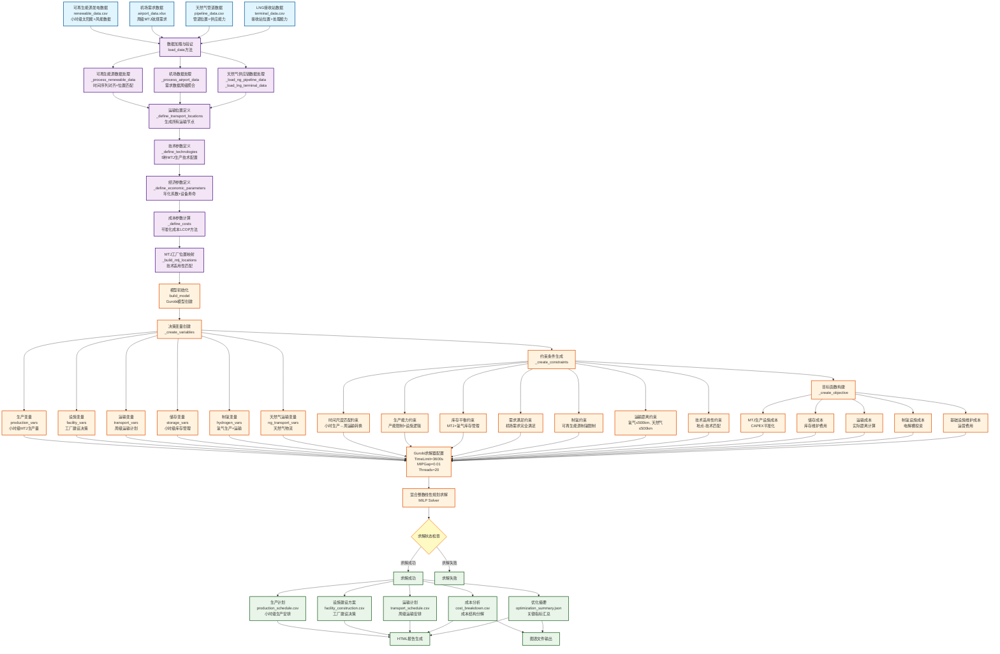

# 天然气供应链优化模型详细流程图

## 完整优化流程图（上下结构）

## 关键技术特点说明

### 1. 时间尺度匹配机制
- **生产决策**: 小时级 (168小时/周)
- **需求数据**: 周级
- **库存缓冲**: 实现时间尺度转换
- **运输计划**: 周级聚合

### 2. 五种MTJ生产技术
1. **管段直供MTJ生产** (pipeline_direct_conversion)
2. **机场集成MTJ生产** (airport_integrated_conversion)  
3. **LNG接收站MTJ生产** (lng_terminal_conversion)
4. **LNG转运MTJ生产** (lng_to_hplant_conversion)
5. **综合供应MTJ生产** (integrated_supply_conversion)

### 3. 平准化成本方法 (LCOP)
- 统一处理CAPEX和OPEX
- 考虑设备全生命周期成本
- 12%年化系数应用
- 避免重复计算问题

### 4. 距离计算优化
- **实际距离计算**: 所有运输成本基于真实地理距离
- **运输限制**: 氢气≤500km, 天然气≤500km
- **成本精度**: 提高决策准确性

### 5. 模型规模
- **决策变量**: 10,000-50,000个
- **约束条件**: 5,000-25,000个
- **二进制变量**: 约5-10%
- **求解时间**: 最大1小时

### 6. 输出结果格式
- **CSV格式**: 结构化数据，便于后续分析
- **JSON格式**: 摘要信息，便于程序读取
- **时间戳**: 自动添加，避免覆盖
- **分类存储**: 不同类型结果分开保存

---

**流程图版本**: v1.0  
**创建时间**: 2025年7月30日  
**基于模型**: natural_gas_optimization_model.py  
**数学模型文档**: 天然气供应链优化数学模型与数据流分析.md
