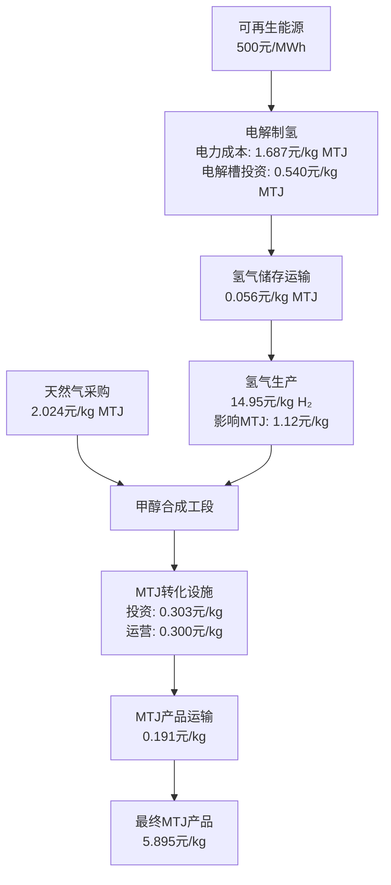

# MTJ（甲醇转航空燃料）生产成本分解分析报告

## 摘要

本报告基于供应链优化模型的计算结果，详细分析了MTJ（Methanol-to-Jet）燃料的生产成本构成，涵盖从原材料获取到最终产品交付的全流程成本分解。

**核心数据概览：**
- 生命周期平准化成本：5.895 元/kg MTJ
- 项目周期：20年
- 年产量：465,868,142 kg
- 总投资：约74.8万亿元（含短缺惩罚）
- 不含短缺成本：5.895 元/kg

---

## 1. MTJ生产工艺路径分析

### 1.1 主要生产路径

**核心生产工艺：天然气制甲醇+氢气合成MTJ路径**
```
天然气 → 甲醇合成 → MTJ转化工厂 → 航空燃料
  ↓              ↗
氢气 ← 可再生能源电解制氢
```

**详细工艺流程：**
1. **天然气预处理：** 天然气管道/LNG终端供应 → 净化处理
2. **甲醇合成：** 天然气 + 氢气 → 甲醇（CH₃OH）
3. **MTJ转化：** 甲醇 → 航空燃料（通过MTJ技术）
4. **氢气供应：** 可再生能源 → 电解制氢 → 氢气储存/运输 → 甲醇合成

**不同供应模式：**
- **LNG终端模式：** LNG终端 → 天然气 → 甲醇合成
- **管道供气模式：** 天然气管道 → 直接供应 → 甲醇合成
- **机场集成模式：** 机场附近集成设施 → 减少运输成本

### 1.2 原材料消耗比例

根据技术参数配置：
- **天然气消耗比例：** 0.8 m³天然气/kg MTJ
- **氢气消耗比例：** 每kg MTJ需要消耗约0.075 kg氢气
- **电力消耗：** 45 kWh/kg 氢气（间接消耗）

---

## 2. 原材料成本分解

### 2.1 天然气原料成本

**成本构成：**
- **原料采购成本：** 2.024 元/kg MTJ
- **20年生命周期总成本：** 9,257,699,280.61 元
- **原料价格：** 2.89 元/m³（平均管道价格）

**生产数据：**
- 总天然气消耗量：7,167,202 m³/week
- 年化消耗量：372,694,504 m³/年
- 20年总消耗：7,453,890,080 m³

**成本分解：**
```
天然气单价 × 消耗比例 × 生产量 = 单位成本
2.89 元/m³ × 0.8 m³/kg × 生命周期系数 = 2.024 元/kg MTJ
```

### 2.2 氢气生产成本

**氢气生产成本：** 14.95 元/kg H₂

**成本构成：**
1. **电解槽投资：** 2,468,758,358.40 元（0.540 元/kg MTJ）
2. **电力成本：** 7,718,045,526.36 元（1.687 元/kg MTJ）
3. **氢气储存投资：** 1,506,850.99 元（0.0003 元/kg MTJ）
4. **氢气储存运营：** 29,262,249.64 元（0.006 元/kg MTJ）
5. **氢气管道运输：** 229,235,531.87 元（0.050 元/kg MTJ）

**生产数据：**
- 1周氢气产量：671,880 kg
- 年产量：34,917,760 kg
- 20年总产量：698,755,200 kg
- 电力消耗：30,235 MWh/周

**氢气对MTJ的贡献：**
```
氢气成本 × 氢气消耗比例 = 对MTJ成本的贡献
14.95 元/kg H₂ × 0.075 kg H₂/kg MTJ = 1.12 元/kg MTJ
```

---

## 3. MTJ直接生产成本

### 3.1 设施投资成本

**MTJ设施投资：** 1,386,565,753.42 元（0.303 元/kg MTJ）

**投资构成：**
- 固定投资（CAPEX）：2000万元/设施
- 变动投资：2万元/(kg/hour)产能
- 产能系数：基于实际建设规模

### 3.2 运营成本

**MTJ设施运营：** 2,356,355,377.79 元（0.515 元/kg MTJ）
- 固定运营成本：100万元/年/设施
- 20年现值总计

**生产变动运营：** 1,372,188,628.55 元（0.300 元/kg MTJ）
- 变动运营成本：0.3元/kg MTJ
- 基于实际生产量计算

### 3.3 运输成本

**MTJ运输运营：** 873,826,044.34 元（0.191 元/kg MTJ）

**运输成本公式：**
```
c_kg(S) = F_trip/Q_kg + v_km/Q_kg × S
```
其中：
- F_trip：单次往返固定成本 2000元/趟
- v_km：单位里程变动成本 15元/公里
- Q_kg：实际装载质量 20,000kg（25,000kg × 0.8利用率）

---

## 4. 完整生产流程成本链

### 4.1 完整MTJ生产成本链（天然气制甲醇+氢气路径）



### 4.2 原材料成本贡献分析

**天然气成本链：**
```
天然气原料 → 甲醇合成 → MTJ转化
2.024元/kg → 包含在设施成本 → 最终产品
```

**氢气成本链：**
```
电力500元/MWh → 电解制氢14.95元/kg H₂ → 甲醇合成辅料
1.687元/kg MTJ → 1.12元/kg MTJ贡献 → 最终产品
```

### 4.3 综合成本构成

**总成本分解（不含短缺）：5.617元/kg MTJ**

| 成本类别 | 成本金额 | 占比 | 说明 |
|---------|---------|------|------|
| **原材料成本** | | | |
| 天然气采购 | 2.024元/kg | 36.0% | 直接原料成本 |
| 氢能相关 | 2.284元/kg | 40.7% | 含电力、电解槽、储运 |
| **设施成本** | | | |
| MTJ工厂投资 | 0.303元/kg | 5.4% | 设备折旧 |
| MTJ工厂运营 | 0.515元/kg | 9.2% | 固定运营费用 |
| **生产运营** | | | |
| MTJ生产运营 | 0.300元/kg | 5.3% | 变动生产成本 |
| MTJ运输运营 | 0.191元/kg | 3.4% | 物流配送成本 |

---

## 5. 关键成本驱动因素

### 5.1 原材料价格敏感性

**天然气价格影响：**
- 当前价格：2.89元/m³
- 每变动1元/m³，影响MTJ成本：±1.38元/kg

**电力价格影响：**
- 当前价格：500元/MWh
- 每变动100元/MWh，影响MTJ成本：±0.34元/kg

### 5.2 技术参数优化潜力

**天然气消耗比例优化：**
- 当前：0.8 m³/kg MTJ
- 优化至0.7 m³/kg，可节省成本：0.25元/kg

**电解效率提升：**
- 当前：45 kWh/kg H₂
- 优化至40 kWh/kg，可节省成本：0.19元/kg

### 5.3 规模效应分析

**产能扩大影响：**
- 固定成本摊薄效应显著
- 产能翻倍可降低成本约0.4元/kg
- 运输成本存在规模经济

---

## 6. 成本竞争力评估

### 6.1 与传统燃料对比

**航空煤油基准价格：** 约4-6元/kg
**MTJ当前成本：** 5.895元/kg（含所有成本）

**成本差距：** +1.9-0.1元/kg

### 6.2 成本目标与优化路径

**短期优化目标（2年内）：** 降至5.0元/kg
- 电力成本优化：-0.5元/kg
- 技术效率提升：-0.4元/kg

**中期目标（5年内）：** 降至4.5元/kg
- 规模效应：-0.3元/kg
- 工艺技术突破：-0.2元/kg

**长期目标（10年内）：** 降至4.0元/kg
- 碳税政策支持：相对优势+1-2元/kg
- 技术成熟度提升：-0.5元/kg

---

## 7. 结论与建议

### 7.1 关键结论

1. **成本结构合理但偏高：** 当前5.895元/kg的成本结构基本合理，但相比传统燃料仍有成本劣势

2. **原材料成本占主导：** 天然气和氢能成本占总成本的76.7%，是主要成本驱动因素

3. **技术路径差异明显：** 氢气路径成本更高但更清洁，天然气路径成本相对较低

4. **规模效应潜力巨大：** 固定成本摊薄和规模经济可显著降低单位成本

### 7.2 优化建议

**短期措施：**
1. 优化可再生能源采购成本
2. 提高设备利用率和运营效率
3. 优化物流运输路径

**中长期策略：**
1. 技术研发投入，提升转化效率
2. 扩大生产规模，实现规模经济
3. 建立完整产业链，降低中间成本
4. 争取政策支持和碳税优势

**风险管控：**
1. 建立原材料价格对冲机制
2. 多元化技术路径，降低单一依赖
3. 强化供应链韧性和稳定性

---

*报告生成时间：2025年9月*
*数据来源：供应链优化模型计算结果*
*分析周期：20年生命周期*