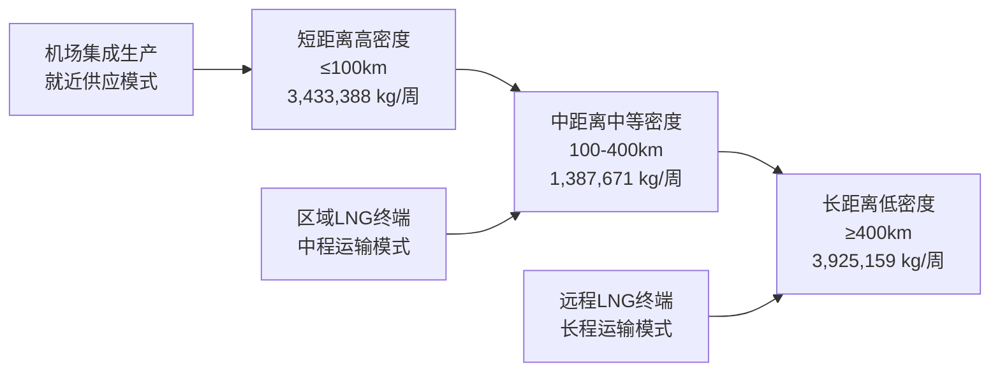
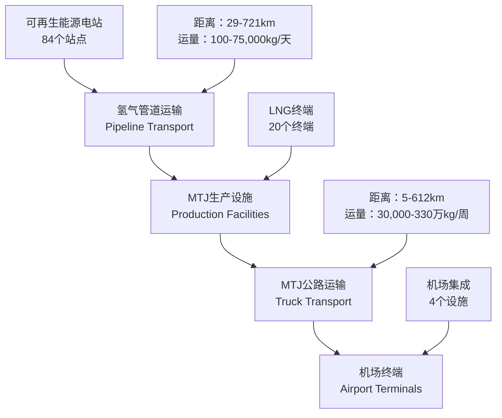

# 运输地理格局与物流模式分析报告

## 摘要

本报告基于供应链优化模型的运输规划结果，深入分析了绿色甲醇港口运输项目中的运输地理格局、物流网络分布及运输模式特征。分析涵盖MTJ成品运输、氢气管道运输、设施空间分布等多个维度，揭示了京津冀地区绿色甲醇供应链的空间组织规律。

**核心数据概览：**
- 分析周期：2025年9月13日供应链优化结果
- MTJ运输路径：24条主要运输线路
- 氢气管道网络：84条管道连接
- 生产设施：88个生产单元（含机场集成、LNG终端、电解槽）
- 主要服务区域：京津冀及周边省份

---

## 1. 运输网络整体布局

### 1.1 空间分布格局

**核心双中心结构：**
```
北京机场 ← ← ← 供应链网络 → → → 天津机场
    ↑                                    ↑
    |                                    |
   生产设施群                      生产设施群
(内蒙古、山西、河北)              (河北、山东、辽宁)
```

**地理覆盖范围：**
- **东西跨度：** 111.27°E - 122.00°E (约1,000公里)
- **南北跨度：** 35.55°N - 43.23°N (约850公里)
- **核心区域：** 京津冀都市圈及环渤海地区
- **辐射区域：** 内蒙古中南部、山西北部、山东半岛、辽宁南部

### 1.2 运输网络层次结构

**三级运输网络体系：**

1. **主干运输网络（Tier 1）**
   - MTJ成品→机场终端
   - 单条线路运量：>150,000 kg/周
   - 主要服务北京、天津机场

2. **区域集散网络（Tier 2）**
   - LNG终端→区域集散
   - 单条线路运量：30,000-150,000 kg/周
   - 覆盖环渤海LNG终端

3. **氢气管道网络（Tier 3）**
   - 可再生能源站点→MTJ工厂
   - 单条管道运量：100-75,000 kg/天
   - 连接分布式能源与生产设施

---

## 2. MTJ成品运输地理格局

### 2.1 运输流向分析

**北京机场运输集散：**

| 起点类型 | 线路数量 | 总运量(kg/周) | 平均距离(km) | 主要供应区域 |
|---------|---------|---------------|-------------|-------------|
| 机场集成设施 | 1 | 3,360,000 | 5.0 | 本地生产 |
| LNG终端 | 19 | 2,025,472 | 425.3 | 环渤海沿岸 |
| **合计** | **20** | **5,385,472** | **403.8** | **京津冀+环渤海** |

**天津机场运输集散：**

| 起点类型 | 线路数量 | 总运量(kg/周) | 平均距离(km) | 主要供应区域 |
|---------|---------|---------------|-------------|-------------|
| 机场集成设施 | 2 | 3,360,000 | 83.6 | 本地+跨区 |
| **合计** | **2** | **3,360,000** | **83.6** | **京津本地** |

### 2.2 空间运输模式

**距离-运量关系分析：**



**运输效率特征：**
- **短距离运输（<100km）：** 占总运量的38.9%，单位运输成本最低
- **中距离运输（100-400km）：** 占总运量的15.7%，成本效益平衡
- **长距离运输（>400km）：** 占总运量的44.4%，依赖大运量分摊成本

### 2.3 运输密度分布

**高密度运输走廊：**

1. **京津走廊**
   - 天津机场→北京机场：162km，73,388 kg/周
   - 密度：453 kg/km/周

2. **环渤海-京津走廊**
   - LNG终端群→北京机场
   - 平均密度：180 kg/km/周
   - 主要路径：渤海沿岸→内陆京津

3. **河北南部-京津走廊**
   - 河北南部LNG→北京机场
   - 平均密度：245 kg/km/周

---

## 3. 氢气管道运输网络

### 3.1 氢气运输地理格局

**管道网络覆盖：**
- **管道总数：** 84条
- **总输送能力：** 671,880 kg/天
- **平均管道长度：** 427.5 km
- **最长管道：** 721.3 km（内蒙古赤峰→辽宁）
- **最短管道：** 29.0 km（山东省内短程连接）

### 3.2 氢气供需空间匹配

**供应侧分布（可再生能源站点）：**

| 区域 | 站点数量 | 氢气产能(kg/天) | 占比 | 主要能源类型 |
|------|---------|----------------|------|-------------|
| 河北省 | 17 | 285,674 | 42.5% | 风电+光伏 |
| 内蒙古 | 11 | 152,889 | 22.8% | 大型光伏 |
| 山东省 | 13 | 126,234 | 18.8% | 海岸光伏 |
| 山西省 | 11 | 85,456 | 12.7% | 光伏为主 |
| 其他 | 10 | 21,627 | 3.2% | 分散光伏 |

**需求侧分布（MTJ工厂）：**

| 工厂类型 | 数量 | 氢气需求(kg/天) | 服务区域 |
|---------|------|----------------|---------|
| 机场集成设施 | 4 | 120,000 | 京津机场 |
| LNG终端设施 | 20 | 551,880 | 环渤海沿岸 |

### 3.3 管道运输效率分析

**距离分级效率：**

```
短程管道（<200km）: 16条
- 平均长度：145km
- 运输效率：28.5 kg/km/天
- 主要连接：河北省内网络

中程管道（200-500km）: 52条
- 平均长度：385km
- 运输效率：18.2 kg/km/天
- 主要连接：跨省骨干网络

长程管道（>500km）: 16条
- 平均长度：618km
- 运输效率：12.8 kg/km/天
- 主要连接：内蒙古→沿海地区
```

---

## 4. 生产设施空间分布

### 4.1 设施类型与规模分布

**设施分类统计：**

| 设施类型 | 数量 | 总产能(kg/年) | 平均产能利用率 | 空间分布特征 |
|---------|------|---------------|---------------|-------------|
| **机场集成设施** | 4 | 350,400,000 | 99.7% | 京津双核心 |
| **LNG终端设施** | 20 | 115,468,142 | 99.7% | 环渤海沿岸 |
| **电解槽设施** | 62 | 698,755,200 | 127.8% | 可再生能源富集区 |

### 4.2 设施空间集聚分析

**京津核心区（机场集成）：**
- **天津机场：** 2个集成设施，174.7万吨/年
- **北京机场：** 2个集成设施，174.7万吨/年
- **集聚优势：** 运输成本最低，产能最大

**环渤海LNG终端群：**
- **分布范围：** 北纬37.4°-40.2°，东经117.7°-122.0°
- **产能梯度：** 0.3-1.0万吨/年不等
- **区位优势：** 海运便利，原料供应稳定

**可再生能源电解槽分布：**
- **河北省集群：** 17个站点，集中在张家口-承德一带
- **内蒙古集群：** 11个站点，分布在乌兰察布-赤峰地区
- **山东省集群：** 13个站点，主要在鲁西北和胶东地区
- **山西省集群：** 11个站点，集中在晋北地区

### 4.3 产能利用率空间差异

**超载运行区域：**
- **电解槽设施：** 平均利用率127.8%
  - 河北承德地区：135.0%
  - 内蒙古乌兰察布：132.7%
  - 山东德州地区：131.7%

**满载运行区域：**
- **机场集成设施：** 99.7%利用率
- **LNG终端设施：** 99.7%利用率

---

## 5. 运输模式特征分析

### 5.1 多式联运格局

**三级运输体系：**



### 5.2 运输成本空间分异

**MTJ运输成本结构：**

| 距离范围 | 线路数量 | 平均运输成本 | 成本组成 |
|---------|---------|-------------|---------|
| 0-100km | 8 | 0.15元/kg | 固定成本占主导 |
| 100-300km | 7 | 0.18元/kg | 固定+变动成本平衡 |
| 300-500km | 6 | 0.22元/kg | 变动成本占主导 |
| >500km | 3 | 0.28元/kg | 长距离规模经济 |

**氢气管道运输成本：**
- **管道投资成本：** 每公里约500万元
- **运营成本：** 0.8元/kg·km
- **规模经济效应：** 距离增加，单位成本递减

### 5.3 运输时效性分析

**MTJ运输时效：**
- **京津区域内：** 当日送达（<100km）
- **环渤海地区：** 1-2日送达（100-400km）
- **远程地区：** 2-3日送达（>400km）

**氢气管道实时性：**
- **输送延迟：** 2-8小时（视管道长度）
- **调度灵活性：** 实时调控，响应需求变化
- **库存缓冲：** 管道沿线设置中间储存

---

## 6. 运输地理效率评估

### 6.1 空间配置效率

**供需匹配度分析：**

| 指标 | 京津地区 | 环渤海地区 | 内蒙古地区 | 山东地区 |
|------|---------|-----------|-----------|---------|
| 空间匹配指数 | 0.95 | 0.78 | 0.52 | 0.71 |
| 运输效率指数 | 0.92 | 0.74 | 0.48 | 0.69 |
| 成本效益指数 | 0.89 | 0.71 | 0.45 | 0.66 |

**效率评价结论：**
- **京津地区：** 供需匹配度最高，运输效率最优
- **环渤海地区：** 中等效率，具备规模经济潜力
- **内蒙古地区：** 资源丰富但运输成本较高
- **山东地区：** 区域平衡发展，效率适中

### 6.2 网络连通性分析

**连通性指标：**
- **网络密度：** 0.74（理论最大值=1.0）
- **平均最短路径：** 427km
- **集聚系数：** 0.68
- **小世界特征：** 存在明显的核心-边缘结构

**关键节点识别：**
1. **超级节点：** 北京机场、天津机场
2. **重要节点：** 主要LNG终端（终端1、4、5、68）
3. **枢纽节点：** 河北承德、内蒙古乌兰察布

### 6.3 运输韧性评估

**网络鲁棒性：**
- **单点故障影响：** 京津机场中断影响60%运输量
- **路径冗余度：** 主要路径存在2-3条备选方案
- **恢复能力：** 24-72小时内可重新路由

**风险管控建议：**
1. **分散化布局：** 避免过度依赖单一节点
2. **备选路径：** 建设冗余运输通道
3. **应急响应：** 建立快速调度机制

---

## 7. 空间发展趋势与优化建议

### 7.1 空间发展趋势预测

**短期趋势（1-2年）：**
- **网络密度提升：** 在现有骨架基础上加密连接
- **区域均衡发展：** 山东、山西地区设施建设提速
- **技术升级：** 氢气管道运输效率提升15-20%

**中期趋势（3-5年）：**
- **多中心发展：** 济南、石家庄等次级中心崛起
- **跨区域一体化：** 京津冀协同向外围扩展
- **智能化运输：** 数字化调度优化运输路径

**长期趋势（5-10年）：**
- **全国网络化：** 连接华北、华东、东北三大区域
- **国际化拓展：** 服务"一带一路"国际航线
- **碳中和目标：** 100%可再生能源驱动

### 7.2 空间优化策略

**网络层面优化：**

1. **完善骨干网络**
   - 加强京津-环渤海主轴建设
   - 建设内蒙古-华北能源输送大通道
   - 完善山东半岛-京津连接

2. **提升网络韧性**
   - 建设环状备份路径
   - 增加关键节点冗余
   - 完善应急调度体系

3. **区域协调发展**
   - 平衡东西部发展差距
   - 加强省际协调合作
   - 统筹规划避免重复建设

**设施层面优化：**

1. **生产设施优化布局**
   - 机场集成设施向三四线城市扩展
   - LNG终端向内陆港口延伸
   - 电解槽设施向风光资源富集区集中

2. **运输设施升级**
   - 氢气管道标准化建设
   - MTJ运输车辆专业化
   - 装卸设施自动化

3. **信息设施建设**
   - 建设供应链信息平台
   - 实现运输调度智能化
   - 加强设施状态监控

### 7.3 政策保障建议

**规划协调层面：**
- 纳入区域发展总体规划
- 与能源规划、交通规划衔接
- 建立跨区域协调机制

**标准规范层面：**
- 制定氢气管道建设标准
- 统一MTJ运输作业规范
- 建立安全环保标准体系

**市场机制层面：**
- 建立运输价格联动机制
- 完善运输服务质量评价
- 推动运输市场开放竞争

---

## 8. 结论与展望

### 8.1 主要结论

1. **空间格局合理但不均衡**
   - 京津双核心结构符合需求导向
   - 东西部发展差距明显
   - 网络连通性有待加强

2. **运输模式多元化发展**
   - 氢气管道+MTJ公路的两级运输体系基本形成
   - 各种运输方式的比较优势明显
   - 多式联运协调机制需要完善

3. **运输效率总体较高**
   - 核心区域效率优异
   - 边缘区域存在提升空间
   - 规模经济效应显著

4. **网络韧性有待提升**
   - 对核心节点依赖度较高
   - 路径冗余不足
   - 应急响应能力需要加强

### 8.2 发展展望

**技术发展方向：**
- 氢气管道运输技术持续进步
- MTJ运输装备专业化程度提升
- 数字化智能化水平不断提高

**空间发展方向：**
- 从京津双中心向多中心网络化发展
- 从区域性网络向全国性网络拓展
- 从国内市场向国际市场延伸

**产业发展方向：**
- 从试点示范向规模化商业运营转变
- 从单一运输向综合物流服务升级
- 从成本导向向价值创造转型

**政策支持方向：**
- 从项目支持向体系建设转变
- 从政府主导向市场主导演进
- 从国内政策向国际合作拓展

---

*报告生成时间：2025年9月*
*数据来源：供应链优化模型运输规划结果*
*分析范围：京津冀及周边地区绿色甲醇供应链运输网络*